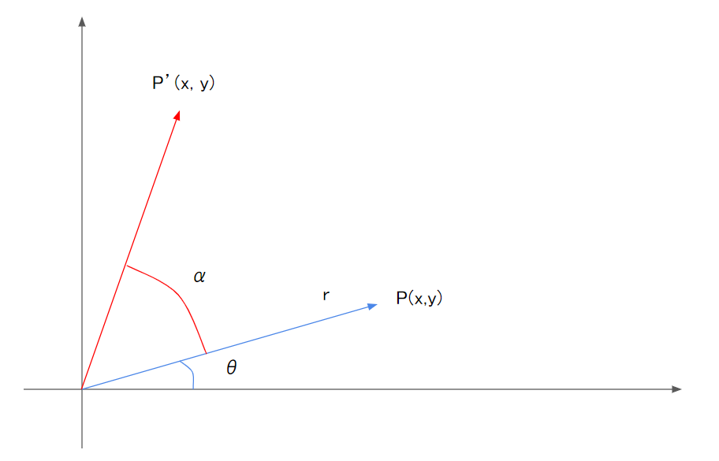

# ベクトルの平行移動・拡縮・回転

ここではコンピュータグラフィックスを扱う上で基本中の基本となるベクトルの移動・拡縮・回転についてまとめたいと思う。

ゲームや映画などで見かけるリアルな映像も、基本となっているのは三角形ポリゴンである。

小さな三角形を沢山繋げて、さまざまなテクニックを駆使することでリアルな映像を作り出している。

この三角形ポリゴンというのは３つの点が集まってできていて

3Dの場合、この点というのは3D空間上の場所を表す数値３つで表現されている。

一般的にはXYZという３つの軸があり、Xがいくつ、Yがいくつ、Zがいくつという感じで表される。

この点を移動・拡縮・回転する事ができれば、いろいろやりたい放題であるため

コンピュータグラフィックスを扱う上では欠かせない基本事項となる。

ただいきなり3Dを扱うと数字が多くて大変だし、2Dでも基本は同じなので

2Dの世界でベクトルを移動・拡縮・回転させるための計算についてまとめていく。

## ベクトルの平行移動

ある位置にある点を、ある位置へ移動する事を平行移動と読んでいる。

- 点Aを点A'の位置に移動するには、x方向に2、y方向に1移動する。

- 点Aは原点から見ると(1, 1)という座標にあり、ここに移動量を加える事で点が移動する。

$A(1, 1)に移動したい量(2, 1)を加える→A'(3, 2)$

要するに平行移動は足し算である

## ベクトルの拡大・縮小

- A(1, 1)というベクトルを2倍にしたいなら、xy成分それぞれを2倍にすればいい
- A(1, 1)というベクトルを半分にしたいなら、xy成分それぞれを0.5倍すればいい

要するに拡大・縮小は掛け算である

## ベクトルの回転

移動と拡縮は簡単なのだが、回転はちょっと難しい。

数学的な要素がてんこ盛りである。

- 点Pの座標は原点からx軸との角度をθとする
- 点P'は点Pをさらにαだけ回転させて点とする
- 点Pも点P'も原点からの距離は同じrとする

$点Pの座標と回転させる角度αを使って点P'の座標を求めるには？$

**ポイント①** 点Pの座標は以下のように表す事ができる。

$$
P_{x} = r \cdot cos \theta　・・・①\\
P_{y} = r \cdot sin \theta　・・・②
$$

**ポイント②** 点P'は以下のように表す事ができる
$$
P'_{x} = r \cdot cos(\theta + \alpha) \\
P'_{y} = r \cdot sin(\theta + \alpha)
$$
これにより加法定理が使える。

加法定理を使ってそれぞれを展開していく。

**P'~x~、P~y~について**
$$
\begin{align}
P'_{x} &= r \cdot cos(\theta + \alpha) \\
&= r(cos\theta cos\alpha - sin \theta sin \alpha) \\
&= r\cdot cos\theta cos\alpha - r \cdot sin\theta sin\alpha \\
&= P_{x} cos\alpha - P_{y} sin\alpha　・・・①②より
\end{align}
$$

$$
\begin{align}
P'_{y} &= r \cdot sin(\theta + \alpha) \\
&= r(sin\theta cos\alpha + cos \theta sin \alpha) \\ 
&= r \cdot sin\theta cos\alpha +r \cdot cos\theta sin\alpha \\
&= P_{y} cos\alpha + P_{x} sin\alpha　・・・①②より
\end{align}
$$

**まとめると以下の計算でベクトルを回転させることができる**
$$
P'_{x} = P_{x} cos\alpha - P_{y} sin\alpha \\
P'_{y} = P_{y} cos\alpha + P_{x} sin\alpha
$$

