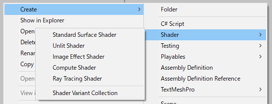

# Unity シェーダー

Unityで使えるシェーダーは主に3種類があります。


- 固定機能シェーダー
- surfaceシェーダー
- 頂点・フラグメントシェーダー


これがそれぞれなんなのかということは後ほど


### Unityでシェーダーを作成する

UnityのProjectウィンドウからShaderを作成しようとすると、以下のように複数の選択肢があります。

それぞれについてわかる範囲でまとめてみました。




| 選択肢                    | 分類               | 言語      | 補足                                                         |
| ------------------------- | ------------------ | --------- | ------------------------------------------------------------ |
| Standard Surface Shader   | サーフェイス       | ShaderLab | サーフェイスシェーダー書くならとりあえずこれを作れば良さそう。 |
| Unlit Shader              | 頂点・フラグメント | ShaderLab |                                                              |
| Image Effect Shader       | 頂点・フラグメント | ShaderLab |                                                              |
| Compute Shader            | 不明               | 不明      | いわゆるGPGPUを行うためのもの                                |
| Ray Tracing Shader        | 不明               | 不明      | 調べていない                                                 |
| Shader Variant Collection | 不明               | 不明      | 調べていない                                                 |


**あれ？固定機能シェーダーは？**

上記には固定機能シェーダーというものが含まれていません。

というのもUnityの場合、サーフェイスシェーダーであろうと、頂点フラグメントシェーダーであろうと、固定機能シェーダーであろうと、ShaderLabという言語(書式？)を使って記述します。

そのため、サーフェイスシェーダーを作成しても、その中身を書き換えてしまえば固定機能シェーダーにする事が可能です。

固定機能シェーダーはそもそもあまり使うことがないと思われるので、最初から選択肢に含まれていないのではないかなと思っています。


## 余談：Shader Graphについて

上記で説明したShaderとは別に、Shaderグラフというものもあります。

これはシェーダーをプログラムで作るのではなく、GUIベースでノードを繋げてシェーダーを作成するものです。

いわゆるビジュアルスクリプトに該当するものですが、Unityにはそういった方法でシェーダーを作成するができます。


## 各種シェーダーの特徴


### 固定機能シェーダー

固定機能シェーダーは予め用意された機能を組み合わせるだけで描画する方法です。

出来る事が非常に限られているので、ほとんど使用しません。


### サーフェイスシェーダー

サーフェイスシェーダーは計算が大変なライティングやシャドー(影)の処理が自動適用されるお手軽シェーダーになります。


シェーダーを０から自分で作ろうと思うと、やることが色々あるのですが、その多くは決まりきった事をやるパターンが多く、サーフェイスシェーダーはそういっためんどくさい事は全てUnityにお任せして、重要なところだけ自分でちょっとカスタマイズしようという用途で使うシェーダーとなります。


サーフェイスシェーダーには主に以下の処理を記述する事ができます。


- 頂点シェーダー
- フラグメントシェーダー
- ライティング


これらを全て記述する必要はなく、フラグメントシェーダーだけ書けば、その他のものはUnityが良しなにやってくれます。

レンダリングの一部の工程を上書きできるようなイメージですね。


### 頂点・フラグメントシェーダー

これはUnityのライティングやシャドーが適用されないシェーダーです。

Unityのライティング効果をかけたくない、もしくは必要ない時や、サーフェイスシェーダーで表現しきれないような場合はこちらを選択します。


## ShaderLabとは？

ShaderLabはUnityでシェーダーを書くときに使われるUnity独自の書式の事です。

固定機能シェーダーでも、サーフェイスシェーダーでも、頂点・フラグメントシェーダーでもShaderLabで記述していきます。


---


## サーフェイスシェーダーの概要

### ShaderLab 基本の書き方

```
Shader "シェーダーの名前" 
{
	Properties {}
	SubShader {}
	SubShader {}
	SubShader {}
    
    FallBack "Diffuse"
}
```


#### Shader ブロック

Unityでシェーダーを記述する場合はまず `Shader "Shaderの名前" {}` を記述し、このブロックの中に処理を記述していくのがお約束になります。

"シェーダーの名前"の部分は自由ですが、ここに記述した名前がUnity上でシェーダーを選択する際に表示される名前になります。

例) "Custom/MyShader" など


#### Properties ブロック

シェーダーの外からシェーダーにパラメータを渡すために使います。

例えば、色をシェーダーの中で固定してしまうと、そのシェーダーでは他の色を描画できなくなります。

Propertiesに色を定義し、色を外から設定できるようにすることで色んな色を描画するシェーダーにすることができます。


#### SubShader ブロック

シェーダーの設定や、実際にシェーダーの処理を記述していくブロックです。

SubShaderブロックは複数記述する事ができますが、これはシェーダーというのはプラットフォームによって実装が異なるため、シェーダーを書く人はプラットフォーム事に複数のシェーダーを書く必要があるためです。

プラットフォーム毎にシェーダーを定義しておくと、実行時にUnityが上から順に「このシェーダーは動くか？」という事をチェックし、動くシェーダーが見つかればそれを実行します。


#### FallBack

これは UnityがSubShaderを確認していき、最終的に動くシェーダーがなかった時に適用するシェーダーを指定するキーワードです。

`Diffuse`とはシンプルに色を描画するだけのシェーダーで、基本的にどの環境でも動作するシェーダーですが、見た目はしょぼいものとなります。

シェーダーがなくげゲームがクラッシュするよりはしょぼくてもいいからとりあえず描画しとけ的なものになります。


## Properties

Propertiesブロックの中には、外から設定したパラメータを記述しますが、パラメータの種類によって多少書き方が異なります。(といってもそんなに大きくは変わりませんが)

ひとまず`Float`の値を１つ受け取る例がこちらになります。

```c
Properties {
    _Number ("数値", Float) = 0
}
```

- _Number の部分はシェーダー内で使用する際の名前(変数名)になります
- ("数値", Float) の `"数値"`の部分はインスペクター上で表示される名前で、`Float`はデータの方を指定します
- `= 0`は初期値をしています。


その他のデータ型についてのパターンはこちら。

```
Properties {
    nameInShader ("display name", Range (min, max)) = number
    nameInShader ("display name", Color) = (number,number,number,number)
    nameInShader ("display name", 2D) = "name" { options }
    nameInShader ("display name", Rect) = "name" { options }
    nameInShader ("display name", Cube) = "name" { options }
    nameInShader ("display name", Float) = number
    nameInShader ("display name", Vector) = (number,number,number,number)
}
```


## SubShaderブロック


## Minimam Shader

最低限必要な事だけを書いたシェーダー

```c
Shader "Custom/sample" // Shaderの名前
{
	// 外から受け取るパラメーターを定義するブロック
	// ここに定義するとインスペクタから設定可能になる
	Properties{

	}

	// シェーダーの内容を記述するブロック
	SubShader
	{
		// シェーダーの設定を記述
		Tags { "RenderType" = "Opaque" }
		LOD 200

		// CGPROGRAM ~ ENDCD の間にシェーダーの処理を記述
		CGPROGRAM

		// シェーダーの設定
		#pragma surface surf Standard fullforwardshadows
		#pragma target 3.0

		// サーフェイスシェーダー(フラグメントシェーダー)関数の引数に渡す情報の構造体定義
		// このシェーダーでは利用していないが、書かないとエラーになる。
		struct Input
		{
				float2 uv_MainTex;
		};

		// サーフェイスシェーダー本体、最終的に描画する色を決定する
		// 引数に渡ってくる o に設定したい値をセットする。
		void surf(Input IN, inout SurfaceOutputStandard o)
		{
				o.Albedo = fixed4(1.0f, 1.0f, 1.0f, 1);
		}
		ENDCG
	}

	// 動くシェーダーがなかった時に使われるシェーダーを指定する。
	FallBack "Diffuse"
}
```


## サーフェイスシェーダーコンパイルディレクティブ

サーフェイス関数を定義しても、それがサーフェイス関数であることをUnityに伝えなければ意味がありません。

そのために使用するのがサーフェイスシェーダーコンパイルディレクティブで以下が構文です。

```
#pragma surface surfaceFunction lightModel [optionalparams]
```


具体例として、Unity5.x系でサーフェイスシェーダーを作成すると、おそらく以下のようになっているはずです。

```
#pragma surface surf Standard fullforwardshadows
```

- `#pragma surface`までは決まり文句です
- 次の`surf`はサーフェイス関数の名前を指定します
- `Standard`はライティングのモードで、物理ベールライティングになるそうです。
- `fullforwardshadows`はオプションです


**lightModelについて補足**

Unityに組み込まれているlightModelは以下の4種類があるそうです。またlightModelをカスタマイズする方法もあるそうです。

このlightModelによって、サーフェイス関数が出力するべき情報も変わったりするのでその関係性も重要になります。

| LightModel       | 出力構造体                    | 補足               |
| ---------------- | ----------------------------- | ------------------ |
| Standard         | SurfaceOutputStandard         | 物理ベース         |
| StandardSpecular | SurfaceOutputStandardSpecular | 物理ベース         |
| Lambert          | SurfaceOutput                 | 物理ベースではない |
| BlinnPhong       | SurfaceOutput                 | 物理ベースではない |


## サーフェイス関数で出力すべきもの

最終的な描画色を決定するサーフェイス関数では`SurfaceOutput構造体`に描画に必要な情報を書き込みます。

前述のとおり、利用するlightModelによって扱うべき構造体がかわります。


以下の構造体はlightModelが`Lambert`や`BlinnPhong`の時に使われる構造体です。

```c
struct SurfaceOutput {
    fixed3 Albedo; // ディフューズ色
    fixed3 Normal; // 接線空間法線
    fixed3 Emission; // ライティングに関係なく出力される基本色
    half Specular; // 0~1のスペキュラーパワー
    fixed Gloss; // 0~1のスペキュラー強度
    fixed Alpha; // 透明度のアルファ
}
```


## リファレンス

- [サーフェイスシェーダーの記述](https://docs.unity3d.com/ja/current/Manual/SL-SurfaceShaders.html)
- [シェーダーのデータ型と精度](https://docs.unity3d.com/ja/2019.4/Manual/SL-DataTypesAndPrecision.html)
- [Build-in shader variables](https://docs.unity3d.com/Manual/SL-UnityShaderVariables.html)
- [GUI Instancing](https://docs.unity3d.com/Manual/GPUInstancing.html)


## 参考サイト

- [その１ UnityにおけるShaderとは](http://marupeke296.com/UNI_S_No1_WhatIsShaderInUnity.html)
- [その２ ShaderLabでUnityシェーダーの下地作り](http://marupeke296.com/UNI_S_No2_ShaderLab.html)

- [その３ サーフェイスシェーダー](http://marupeke296.com/UNI_S_No3_SurfaceShader.html)

- [UnityのシェーダーのLODを調べてみた](https://techblog.gmo-ap.jp/2016/12/27/unity%E3%81%AE%E3%82%B7%E3%82%A7%E3%83%BC%E3%83%80%E3%83%BClod%E3%82%92%E8%AA%BF%E3%81%B9%E3%81%A6%E3%81%BF%E3%81%9F/)


- [Unityシェーダープログラム入門 UnlitShaderの要素を全て解説](https://amagamina.jp/unity-shader/)


## float half fixed

| 型    | 精度  | 用途                                                         |
| ----- | ----- | ------------------------------------------------------------ |
| float | 32bit | ワールド座標、テクスチャ座標、三角関数、累乗、べき乗など複雑な計算で精度が求められるケースで利用する |
| half  | 16bit | -60000~+60000、小数点以下は約3桁。方向、オブジェクト空間の位置、HDRカラーなど比較的精度が下がってもよいケースで利用する |
| fixed | 11bit | -2.0~+2.0の範囲で、1/256の精度。一般的に色(0 ~ 255)など、単純な数値でよいケースで利用する |


## 基本的な関数

| 関数名   | 例          | 説明               |
| -------- | ----------- | ------------------ |
| saturate | saturate(x) | xを0 ~ 1にクランプ |
| dot      | dot(v1, v2) | ベクトルの内積     |
| pow      | pow(x, n)   | xをn乗する         |

