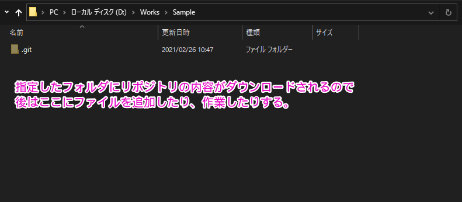

# githubを使う例(Source Tree編)

githubでリポジトリを作成したり、Source Treeを使ってコードを管理したりする場合

その手順については数パターンあるので、とりあえず一番シンプルと思われる方法について記載。

## 概要

この例では予めにgithubでリポジトリを作成しておき、そのリポジトリをローカルに持ってくる(クローン)する方法です。

※逆パターンとしてPCのローカルにリポジトリを作っておき、後からgithubにローカルのリポジトリをアップするという事もできますが、今回はその方法について記載はしていません。

## githubでリポジトリを作成する

## 作成したリポジトリのURLをコピー

## SourceTreeを使ってリポジトリをクローン

Cloneに成功すると、↑で指定したフォルダにリポジトリが作成(ダウンロード)されます。

## ファイルを追加する

Cloneした後はこのフォルダ(リポジトリ)の中で作業していきます。

## ローカルの変更をリモートに反映する

ローカルのリポジトリでファイルを追加したり、変更したりするとSourceTreeに変更のあったファイルが表示されます。

このファイルをコミットして、プッシュする事で、ローカルの変更をリモート、つまりgithubのリポジトリに反映されます。

以降はこの繰り返しになります。

基本はファイルを追加、変更したらコミット

追加開発や修正などでファイルを追加、変更する→コミット

のように何かしたらある程度のまとまりでコミットします。

またリモートリポジトリにアップする際にはプッシュをします。

基本はコミットで、ある程度コミットがたまってきたらプッシュしてリモートに反映する

という感じでやっています。

以上です。

## その他

gitにはブランチなど、その他多くの機能がありますが

最初はブランチなどは気にせずにまずコミットしてプッシュしてコード管理する事に慣れるのが良いと思います。

その中で少しずつ、gitやgithubの違いであったり

よく見かけるoriginってなに？リモートリポジトリ？ローカルリポジトリ？

またブランチやプルリクエスト、gitを使ったバージョン管理手法(git-flowなど)について

学習していくと良いと思います。

とりあえず個人でソースコードを管理する程度であれば

Clone, Commit, Push, Pull がわかればひとまずOKです。