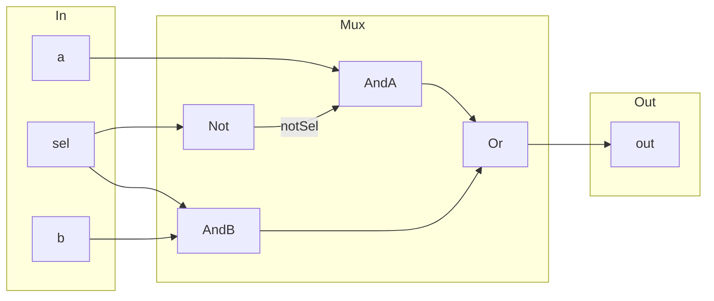
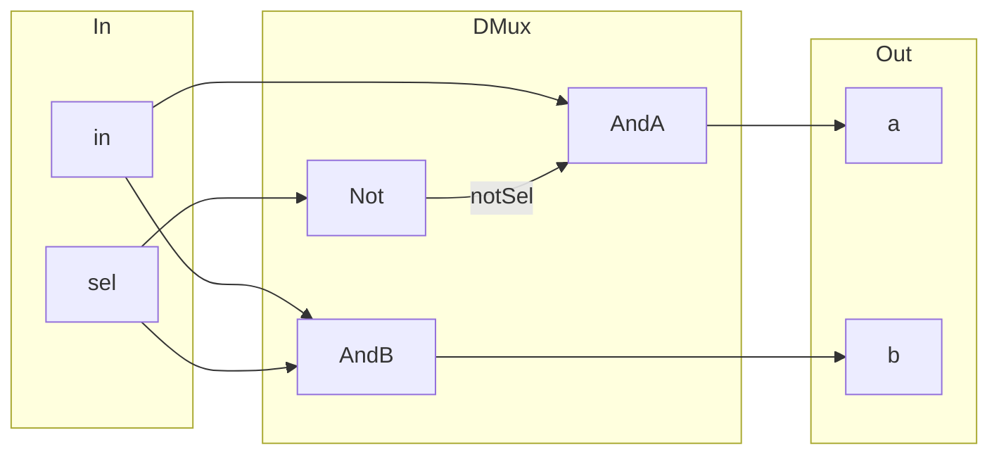
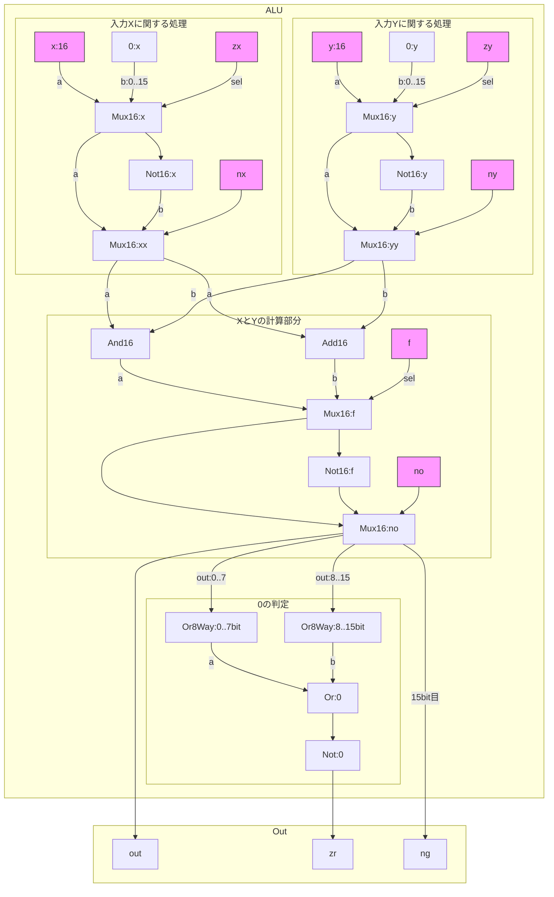

## 段階別スキルチェック

1. 回路の概要を捉えられる
2. 回路で実現すればいいことを把握できる = テストコードが書ける
3. 実現したいことを回路図で考えられる = 設計力
4. 回路図をHDLに書き起こせる = 実装力


### マルチプレクサ

2つのうちどちらか一方を返す。プログラムに例えると三項演算子と同じ。


#### jsで表現した場合

```js
function Mux(a, b, sel) 
{
	return (sel == 0)? a : b;
}
```


上記はプログラマ的にわかりやすく書いたものだけど、より回路構造に近い処理で書くとこんな感じ

```js
// a,b,selは全てbool(0 or 1)という前提で書くと
function Mux(a, b, sel)
{
    const notSel = !sel;
    
    const outA = a && notSel;
    const outB = b && sel;
    
    return outA || outB;
}
```


#### 回路図のイメージ




#### HDLで記述

```HDL
CHIP Mux {
	IN a, b, sel;
	OUT out;

	PARTS:
	Not(in=sel, out=notSel);
	And(a=a, b=notSel, out=andA);
	And(a=b, b=sel, out=andB);
	Or(a=andA, b=andB, out=out);
}
```


> **難しいポイント**
> プログラムで実装する場合は論理的というか、意味を考えながら実装できるが、回路を組む場合は物理的に考える側面が強いので、そこが難しく感じる所だと思った。


### デマルチプレクサ

やってきたデータを右に進ませるか、左に進ませるかを分岐できるのがデマルチプレクサ。
動作としては電車の進路切り替え機と同じ。


#### jsで表現した場合

```js
function DMux(in, sel) 
{
	const out = {
		a : null,
		b : null
	};

	if (sel == 0) {
		out.a = in;
	} else {
		out.b = in;
	}

	return out;
}
```


#### 回路図のイメージ



#### HDLで記述

```HDL
CHIP DMux {
    IN in, sel;
    OUT a, b;

    PARTS:
    Not(in=sel, out=notSel);
    And(a=in, b=notSel, out=a);
    And(a=in, b=sel, out=b);
}
```


### ALU

端的にいえば、8個の引数を受け取り、3個の戻り値を返す関数である。

8個の引数のうち2つは、`x,y`という2つの入力値。残りの6個は`x, y`に対して特定の処理をするかしないかの処理制御フラグである。

#### jsで表現した場合

```js
/**
 * x, y : ２つの入力、どちらも16bitという想定
 * zx : 入力xを0にする
 * nx : 入力xを反転する
 * zy : 入力yを0にする
 * ny : 入力yを反転する
 * f  : f=1ならx+y、f=0ならx&y の演算を行う
 * no : 計算結果をを反転する
 */
function ALU(x, y, zx, nx, zy, ny, f, no)
{
    // xをゼロにする？
    x = (zx == 1)? 0 : x;
    
    // xを反転する、jsだとビット反転~(ﾁﾙﾀﾞ)演算に該当
    const notX = ~x;
    x = (nx == 1)? notX : x;
    
    // yをゼロにする？
    y = (zy == 1)? 0 : y;
    
    // yを反転する
    const notY = ~y;
    y = (ny == 1)? notY : y;
    
    // fが1なら加算、0ならAND演算
    const add = x + y;
    const and = x & y;
	let out = (f == 1)? add : and;
    
    // noが1なら出力を反転
    const notOut = ~out;
    out = (no == 1)? notOut : out;
    
    // out, zr, ngを返す
    return {
        out: out,
        zr : !((out & 0x0F) | ((out >> 8) & 0x0F)), // 0判定
        ng : (out >> 15) & 0b0000000000000001;      // マイナス判定
    };
}
```


#### 回路図のイメージ



**補足**

- 0の判定は全てのビットが0ならば0という判定を行っている。
  - `Or8way`は8個のbitのうち1つでも1なら1を返す回路なので、16bit分を判定するために2つ必要になる。
  - 16bitのうち上位8bit、下位8bitに分けて判定し、更にその結果のどちらかが1であれば0ではないということになるので、論理和を取る(Or)
  - 最終的に0の場合は`Or:0`から`0`が出てくるので、これを`Not`で反転すれば、結果が0のときだけ`zr`は`1`になるという寸法。
- 二進数の場合、マイナスの数は最上位ビットが1になるので、`ng`には`Mux16:no`の出力の15ビット目を割り当てている。
- プログラムの場合、条件分岐が先にきて、条件によって実行する処理を変えるという考え方に慣れているが、回路の場合は逆になり、先に処理をして必要になる可能性のあるデータを用意し、どっちを選ぶのかを後で決めるという考え方になるので、その感覚を掴むと少しやりやすくなるかもしれない。


#### HDLで記述

```HDL
CHIP ALU {
    IN  
        x[16], y[16],  // 16-bit inputs        
        zx, // zero the x input?
        nx, // negate the x input?
        zy, // zero the y input?
        ny, // negate the y input?
        f,  // compute out = x + y (if 1) or x & y (if 0)
        no; // negate the out output?

    OUT 
        out[16], // 16-bit output
        zr, // 1 if (out == 0), 0 otherwise
        ng; // 1 if (out < 0),  0 otherwise

    PARTS:
    // if (zx == 1) set x = 0
    Mux16(a=x, b[0..15]=false, sel=zx, out=xx);

    // if (nx == 1) set x = !x
    Not16(in=xx, out=notx);
    Mux16(a=xx, b=notx, sel=nx, out=xxx);

    // if (zy == 1) set y = 0        // 16-bit constant
    Mux16(a=y, b[0..15]=false, sel=zy, out=yy);

    // if (ny == 1) set y = !y       // bitwise not
    Not16(in=yy, out=noty);
    Mux16(a=yy, b=noty, sel=ny, out=yyy);

    // compute out = x + y (if 1) or x & y (if 0)
    Add16(a=xxx, b=yyy, out=xplusy);
    And16(a=xxx, b=yyy, out=xandy);
    Mux16(a=xandy, b=xplusy, sel=f, out=fout);

    // negate the out output?
    Not16(in=fout, out=notfout);
    Mux16(a=fout, b=notfout, sel=no, out=out, out[15]=ng, out[0..7]=aout, out[8..15]=bout);

    // 1 if (out == 0), 0 otherwise
    Or8Way(in=aout, out=zr1);
    Or8Way(in=bout, out=zr2);
    Or(a=zr1, b=zr2, out=any);
    Not(in=any, out=zr);
}
```

